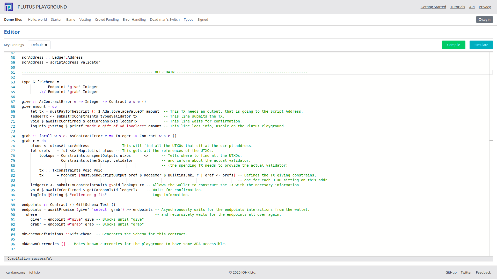
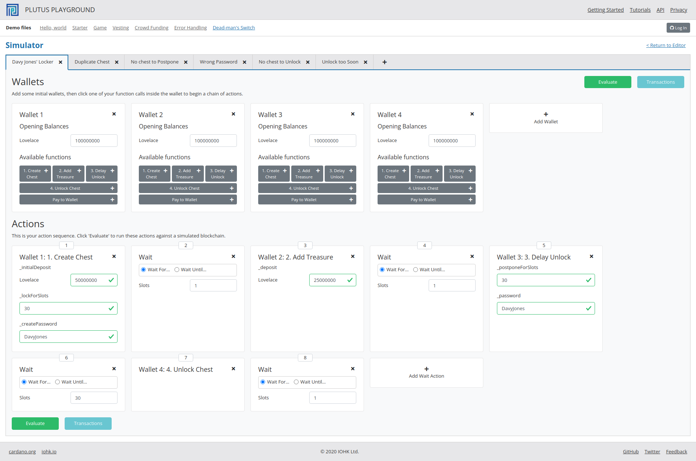
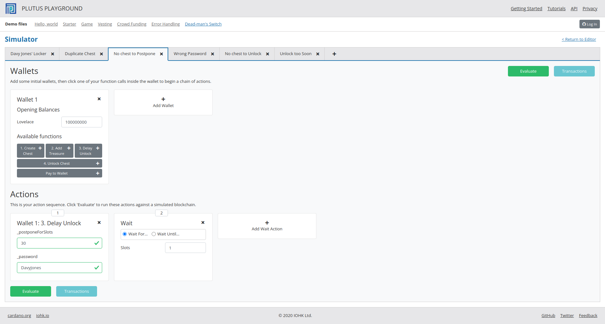
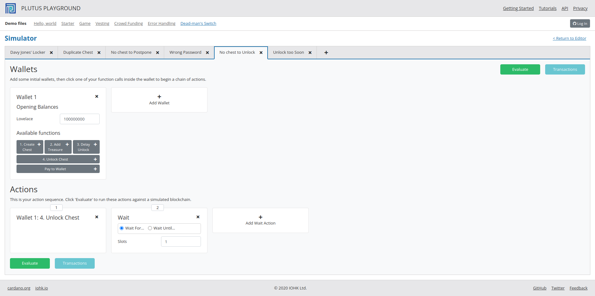

# plutus-playground-server
Plutus Playground Server with additional tabs for:
- [Dead-man's Switch (ariady-putra/morbid: Davy Jones' Locker)](https://github.com/ariady-putra/morbid)
- [Week02 (Plutus Pioneer Program)](https://github.com/input-output-hk/plutus-pioneer-program/tree/main/code/week02)
- [Week05 (Plutus Pioneer Program)](https://github.com/input-output-hk/plutus-pioneer-program/tree/main/code/week05)


### Updated for [week 6](https://github.com/input-output-hk/plutus-pioneer-program/blob/main/code/week06/cabal.project#L45) of Plutus Pioneer Program
[`plutus-playground-start-client.sh`](plutus-playground-start-client.sh#L4):
```nix
cd plutus-playground-client
plutus-playground-generate-purs
npm start
```
Added `plutus-playground-generate-purs` to regenerate PureScript Code whenever the Playground client starts, which is needed to update the view as per week 6[^week06] version of Plutus Playground Client [README.md](https://github.com/input-output-hk/plutus-apps/blob/main/plutus-playground-client/README.md#generating-purescript-code)[^readme].

## simulations







[^week06]:Git tag:`6e3f6a59d64f6d4cd9d38bf263972adaf4f7b244`
[^readme]:The PureScript build depends on the presence of a `./generated` folder with bridge code generated by the backend. This code can be generated by running `plutus-playground-generate-purs` which is provided by the nix-shell environment.
